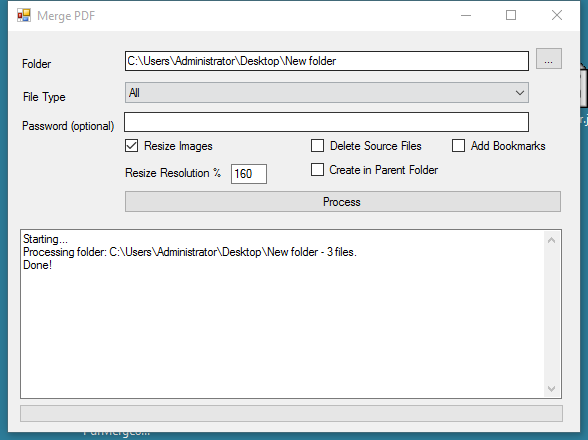

# PDF Merge

Originally posted here:
<https://www.codeproject.com/Articles/69177/PDF-Merge/>

This complete Windows application lets you merge image and PDF files in a given folder into one PDF file. 
It also lets you password protect the PDF file. It uses free iTextSharp library.

## Using the code
To use this program, simply select a folder and click Process. The program will create a PDF file within each folder and subfolder. 
The file will have the same name as the folder plus the PDF extension.
